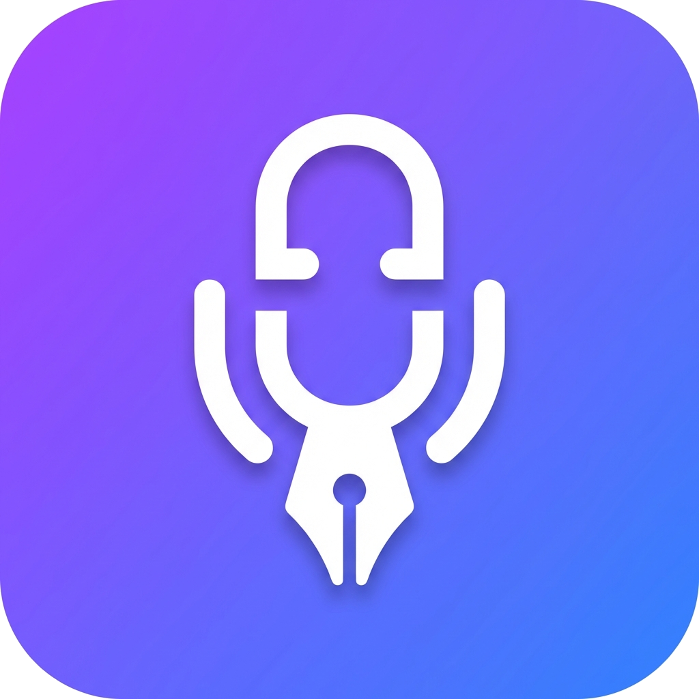

# FluentDraft 🎙️

**Global Voice Typing for Windows** — Powered by Groq, OpenAI, and Whisper.

FluentDraft is a high-performance Windows desktop application that brings AI-powered voice typing to any application. Hold a hotkey, speak, and watch your refined, perfectly puntucated text appear instantly.

<p align="center">
  
</p>

## ✨ Features

- **Global Hotkey** — Dictate into any active window (Notepad, Browser, Slack, IDE).
- **Multi-Language UI** — Interface available in English, Russian, German, Spanish, French, and Italian.
- **AI Refinement** — Automatically corrects grammar, punctuation, and style using LLMs (Llama 3, GPT-4).
- **Refinement Presets** — Create custom presets for different contexts (e.g., "Casual Chat", "Professional Email", "Code Comment").
- **High Fidelity Recording** — Uses `NAudio` for crystal clear voice capture.
- **Visual Feedback** — Minimalist, dark-themed UI with real-time waveform animation.
- **Provider Agnostic** — Supports Groq (fastest) and OpenAI, with extensible architecture.
- **Debug Mode** — Built-in troubleshooting logging for easy diagnostics.

## 🚀 Quick Start

### Download & Install

1. **Download** [FluentDraft-win-Setup.exe](https://github.com/FluentDraft/FluentDraft/releases/latest/download/FluentDraft-win-Setup.exe) (latest version)
2. **Run** the downloaded file — that's it!

> 💡 You can also browse all versions on the [Releases](https://github.com/FluentDraft/FluentDraft/releases) page

### System Requirements

- Windows 10/11
- .NET 10 Runtime (will prompt to install if missing)

---

## 📖 How to Use

### First Launch

1. Launch **FluentDraft** — the app will appear in the system tray
2. Right-click the tray icon → **Settings**
3. Enter your **API Key** (get one from [Groq](https://console.groq.com/) or [OpenAI](https://platform.openai.com/))
4. Select your **Microphone**
5. Click **Save** — you're ready!

### Voice Typing

1. Open any application (Notepad, Browser, Slack, etc.)
2. **Hold `CapsLock`** (or your configured hotkey)
3. **Speak** — the waveform animation shows recording is active
   - *Tip: Press `Esc` or click `Stop` to cancel recording without processing.*
4. **Release** the hotkey
5. **Wait** — Your text will be automatically typed with corrected grammar and punctuation!

### Refinement Presets

Create custom presets for different contexts:
- **Casual Chat** — informal, friendly tone
- **Professional Email** — formal business style
- **Code Comment** — concise technical documentation

Access presets in Settings → Presets.

---

## ⚙️ Configuration

| Setting | Description | Default |
|---------|-------------|---------|
| Setting | Description | Default |
|---------|-------------|---------|
| **Language** | Interface Language (EN, RU, DE, ES, FR, IT) | English |
| **Hotkey** | Key to hold while speaking | `CapsLock` |
| **Microphone** | Audio input device | System default |
| **AI Provider** | Transcription & refinement service | Groq |
| **Preset** | Text refinement style | Default |
| **Debug Mode** | Enable detailed file logging | Off |

---

## 🛠️ For Developers

Want to contribute or build your own version? The project is open source under MIT license.

### Build from Source

```bash
# Clone the repository
git clone https://github.com/FluentDraft/FluentDraft.git
cd FluentDraft

# Build the project
dotnet build

# Run the application
dotnet run --project src/FluentDraft
```

### Tech Stack

- **C# / .NET 10** — Modern, high-performance runtime
- **WPF** — Windows Presentation Foundation for UI
- **CommunityToolkit.Mvvm** — MVVM pattern implementation
- **NAudio** — Audio capture and processing
- **H.NotifyIcon** — System tray integration

---

## 📄 License

This project is licensed under the MIT License — see the [LICENSE](LICENSE) file for details.
